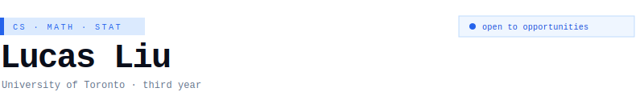

---

### `selected work`

| | project | description |
|:---|:---|:---|
| `● completed` | **Student Response Classifier** | LLM usage classifier · TF-IDF pipeline · 8k trials · 1000+→33 features |
| `● completed` | **Alzheimer's Progression Forecasting** | Music · EEG · cognition · PCA + ridge · 70+ audio · 495 EEG → 15 key features |
| `● live` | **Bird Diversity Analysis Platform** | REST APIs for geospatial ecological data · eBird integration · Django QuerySets |
| `○ wip` | **ML Pipeline System** | End-to-end: ingestion → preprocess → train → eval → inference |
| `○ wip` | **ML Inference Scheduling System** | Request scheduling · batching · latency vs throughput trade-offs |
| `◌ planned` | **LLM Post-training Project** | Prompt eval · output quality analysis · fine-tuning experiments |

---

### `tech stack`

<p>


<br/>


</p>

---

### `current focus`

```
01  ML systems — training, inference, pipeline design
02  LLM post-training · evaluation · optimization
03  Reliable and scalable ML workflows
```

---

<a href="https://www.linkedin.com/in/yuxuan-liu-6a83162a0/">

</a>
&nbsp;

