<!-- 测试用，直接贴进 README.md -->
<svg viewBox="0 0 800 100" width="100%" xmlns="http://www.w3.org/2000/svg">
  <a href="https://github.com" target="_blank">
    <rect x="0" y="0" width="390" height="80" fill="#fafcff" stroke="#dbeafe" stroke-width="1" rx="4"/>
    <text x="16" y="45" font-family="monospace" font-size="15" fill="#0f172a">Click me → GitHub</text>
  </a>
</svg>
